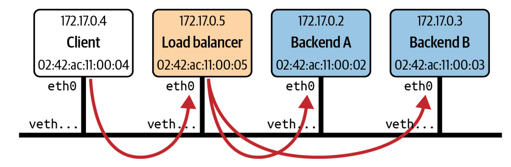

# ebpf-lb

This is a simple eBPF based Round Robin Load Balancer.

# How it works
There are 2 backend servers, 1 client and 1 LB.  
This is a reference image.

The network setup sort of mimics this image.  
The backend and client are just simple python processes running on a machine's port and nothing complicated.  
Although all the components have their own veth pairs, all of them run in the same namespace(lb-ns) for simplicity.  
The veth ending with "-br" is the end of the veth pair that connects to the bridge that sort of ensures all the components are connected, and the other end is actually connected to the component.    

# Steps to run this
I tested this on a Debian12_arm image(VM) on an arm based host machine.  
The main files are `lb_user.py`, `lb_kern.c`.  
Network setup is provided in the respective py file. Please follow that.
```sh
#After the network setup is done follow these
sudo ip netns exec lb-ns sudo python3 -m http.server --bind 172.17.0.2 80 #terminal-1 backend1
sudo ip netns exec lb-ns sudo python3 -m http.server --bind 172.17.0.3 80 #terminal-2 backend2
sudo cat /sys/kernel/debug/tracing/trace_pipe #terminal-3 ebpf app logs
sudo ip netns exec lb-ns python3 lb_user.py #terminal-4 attach the ebpf program to xdp to act as LB
sudo ip netns exec lb-ns curl --interface 172.17.0.4 172.17.0.5 #terminal-5 #client at 4 calls the lb at 5
```